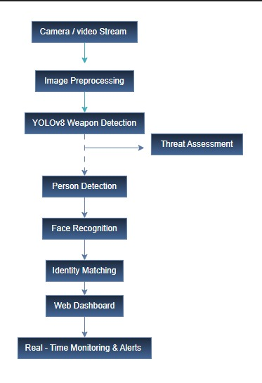
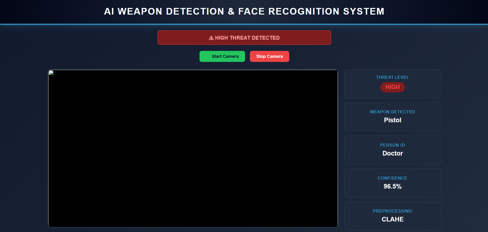
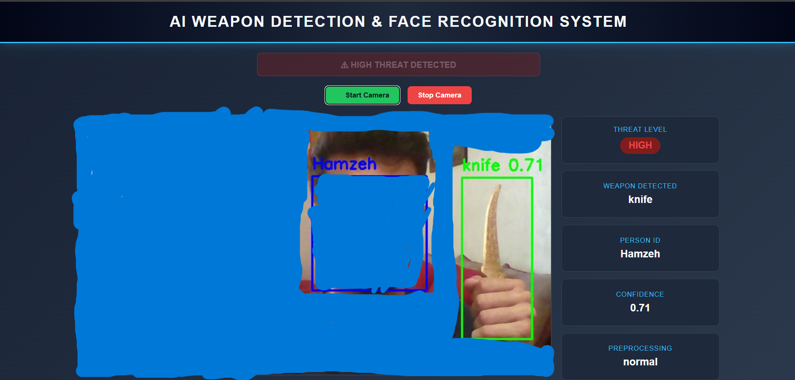

# AI-Assisted Public Threat Detection System


A real-time AI surveillance system that combines **weapon detection**, **face recognition**, and **threat assessment** through an interactive web dashboard.

Developed using **YOLOv8**, **OpenCV**, **Flask**, and **Face Recognition** to demonstrate an end-to-end computer vision pipeline for intelligent public safety monitoring.

## Features

- Real-time weapon detection (Knife, Pistol, Bat)
- Face recognition using facial embeddings
- Threat level classification (None, Low, Medium, High)
- Automatic low-light enhancement (CLAHE)
- Live monitoring dashboard
- SQLite incident logging
- CSV export of incident records
- ONNX-optimized inference for improved performance

## Technologies

- Python
- YOLOv8 (Ultralytics)
- OpenCV
- Flask
- Face Recognition (dlib)
- ONNX Runtime
- SQLite
- NumPy
- Pandas

## Project Overview

The AI-Assisted Public Threat Detection System is an intelligent surveillance platform designed to detect potential public safety threats in real time. The system integrates deep learning-based weapon detection, facial recognition, and a web-based monitoring dashboard into a single application.

Unlike a standalone object detection model, this project provides a complete end-to-end pipeline including data engineering, dataset preprocessing, model training, inference optimization, real-time visualization, and incident management.

The project was developed as a university capstone project with a strong focus on practical deployment and software engineering practices.

## Model Performance

| Metric | Value |
|---------|------:|
| Precision | **94.6%** |
| Recall | **92.5%** |
| mAP@50 | **96.5%** |
| mAP@50-95 | **77.7%** |

The model was trained on a custom weapon detection dataset containing **48,413 images** and **50,713 annotated objects**, including knives, pistols, and bats.

## System Architecture

The overall workflow of the system is illustrated below.



## Dashboard Preview

### Real-Time Detection



### Weapon Detection & Face Recognition



## Installation

### 1. Clone the repository

```bash
git clone https://github.com/HamzehAlBawaneh/AI-Public-Threat-Detection.git
```

### 2. Navigate to the project folder

```bash
cd AI-Public-Threat-Detection
```

### 3. Install dependencies

```bash
pip install -r requirements.txt
```

### 4. Prepare the face database

Create the following folder structure:

```
face_database/
    Person_Name/
        image1.jpg
        image2.jpg
        image3.jpg
```

### 5. Generate face embeddings

```bash
python generate_embeddings.py
```

### 6. Start the application

```bash
python app.py
```

Open your browser and navigate to:

```
http://127.0.0.1:5000
```

## Project Structure

```
AI-Public-Threat-Detection/
│
├── app.py
├── generate_embeddings.py
├── requirements.txt
├── README.md
├── LICENSE
├── .gitignore
│
├── models/
│   ├── best.onnx
│   └── yolov8n.pt
│
├── templates/
│   └── index.html
│
├── screenshots/
│   ├── dashboard.png
│   ├── object_face_detection.png
│   └── system_architecture.jpeg
│
├── face_database/
    └── README.md
```
## Future Improvements

- Multi-camera surveillance support
- Real-time notification system
- Cloud deployment
- Face watchlist management interface
- Multi-object tracking
- Mobile application integration
- Role-based user authentication

## Acknowledgments

This project was developed as a Computer vision & Data mining project for the Artificial Intelligence program at Middle East University.

Special thanks to our supervisor and all team members for their support and valuable feedback throughout the project.

## Contact

**Hamzeh Al-Bawaneh**

- LinkedIn: *www.linkedin.com/in/hamzeh-al-bawaneh-9b6023366*
- GitHub: *HamzehAlBawaneh*